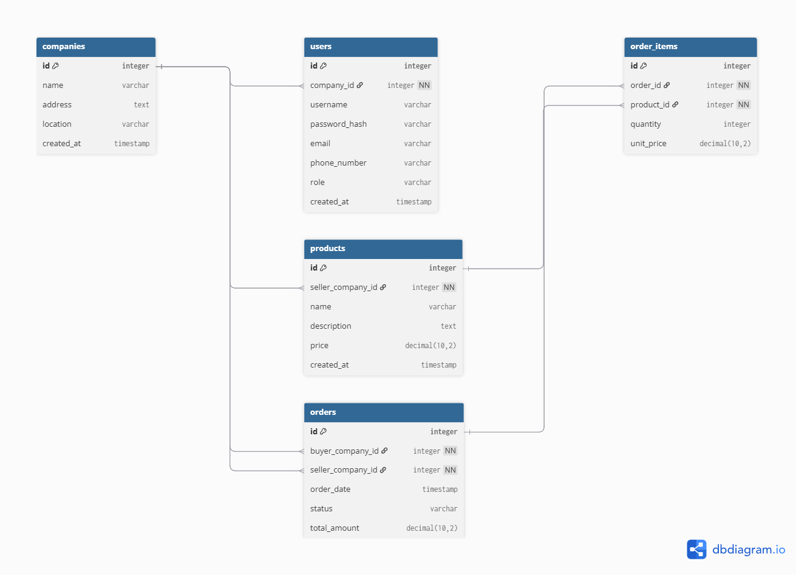
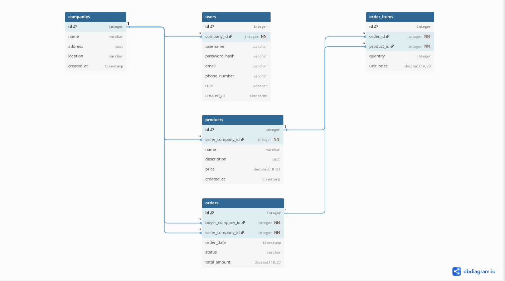

# B2B Marketplace Platform

This project is a business-to-business (B2B) marketplace where registered companies can buy and sell products. This document outlines the database structure, core features, and critical dependencies of the platform.

## Database Design

The database is the backbone of this application, designed to manage companies, users, products, and transactions in an organized way.

[**Click here to see a live, interactive visualization of the database schema.**](https://dbdiagram.io/d/68a633e6466887cb45e5cf75)

---

## How the Database Works (A Simple Explanation)

Imagine the database as a digital filing cabinet that keeps everything organized for our special marketplace. Let's break down this filing cabinet drawer by drawer (or table by table).

### 1. The "Companies" Drawer (`Table companies`)
This is the main address book for every business that signs up. When a new company like "Quick Widgets Inc." joins, we create a file for them here.

*   `id`: A unique number we give each company so we don't mix them up (like a student ID number).
*   `name`: The company's name (e.g., "Quick Widgets Inc.").
*   `address` & `location`: Where the company is located.

### 2. The "Users" Drawer (`Table users`)
A company can't sign in by itself; it needs its employees to do the work. This drawer holds the information for every person who has a login.

*   `id`: A unique ID number for each person.
*   `username` & `password_hash`: How they log in securely.
*   `phone_number`: We store this here so we can send them confirmation texts when they make a deal.
*   `company_id`: **This is the most important part!** It's a special note that links a user to their company in the "Companies" drawer. This is how we know that "John Smith" works for "Quick Widgets Inc."

### 3. The "Products" Drawer (`Table products`)
This is the catalog of everything for sale on the platform. It's like the shelf in a store.

*   `id`: A unique ID for each product.
*   `name` & `description`: What the product is (e.g., "Industrial Grade Screws").
*   `price`: How much it costs. Your website will be smart enough to only show this to people who have logged in.
*   `seller_company_id`: This links the product to the company selling it. So, we know these "Industrial Grade Screws" are being sold by "Quick Widgets Inc."

### 4. The "Orders" Drawer (`Table orders`)
When a company buys something, we need a receipt. This drawer holds the main information for every single transaction.

*   `id`: A unique receipt number for the order.
*   `buyer_company_id`: Links to the company that is *buying*.
*   `seller_company_id`: Links to the company that is *selling*.
*   `status`: Tells us if the order is still being processed, has been shipped, or is complete.

### 5. The "Order Items" Drawer (`Table order_items`)
An order can have many different items in it (like a shopping cart). This drawer lists every single item for every single order.

*   `order_id`: This links each item back to its main receipt in the "Orders" drawer.
*   `product_id`: This links to the specific product from the "Products" drawer.
*   `quantity`: How many of that item were bought (e.g., 50 boxes of screws).

### How it all connects (The Relationships)
The relationships (`Ref` lines in the schema) are like pieces of string connecting the files in different drawers.

*   A `user` is tied to a `company`.
*   A `product` is tied to the `company` selling it.
*   An `order` is tied to both the `company` buying and the `company` selling.
*   An `order_item` is tied to its `order` and to the specific `product`.

This setup ensures that all the information is organized and linked, so when someone from a company logs in, we can show them the right products, let them buy things on behalf of their company, and keep a clean record of every transaction.

---

## Project Features

Based on this database design, your platform can support the following features:

*   **Company Registration:** New businesses can create a profile with their name, address, and location.
*   **User Account Management:** Employees can register under their specific company.
*   **Role-Based Access:** The `role` field in the `users` table allows for different user permissions (e.g., an "admin" user could add other employees, while a "buyer" can only make purchases).
*   **Secure Logins:** Users can log in with a username and password.
*   **Product Dashboard:** A central place to view all available products.
*   **Price Hiding for Guests:** The system can check if a user is logged in before displaying product prices.
*   **B2B Transactions:** Registered users can buy and sell products on behalf of their associated companies.
*   **Order History:** Companies can view a history of all their past purchases and sales.
*   **Phone Number Confirmation:** After a purchase or sale, the system can use the `phone_number` from the `users` table to send a confirmation message.
*   **Inventory Management:** The `products` table tracks which company is selling each item.

---

## Dependencies

The features of this platform have key dependencies within the database. This means some things won't work correctly without others being in place first.

*   **A User cannot exist without a Company:** The `users` table has a `company_id` field. This means you must register a company *before* you can add any employees (users) to it.
*   **A Product cannot be sold without a Seller:** The `products` table has a `seller_company_id`. A product cannot be listed on the dashboard unless it is linked to a registered company that is selling it.
*   **An Order cannot be placed without a Buyer and a Seller:** The `orders` table requires both a `buyer_company_id` and a `seller_company_id`. A transaction cannot exist without two registered companies involved.
*   **An Order is meaningless without Order Items:** The `orders` table only holds general information. The `order_items` table is required to know *what* was actually bought and in *what quantity*. An order cannot be completed without at least one item in it.
*   **Price and Buying functionality depends on User Authentication:** The core feature of hiding prices and allowing purchases is dependent on a user being logged in. If a user isn't registered and logged in, they cannot be linked to a company and therefore cannot buy or sell.

---

## Database Schema Diagrams

The following diagrams show the relationships between all the tables in the database.

### Diagram 1

### Diagram 2

